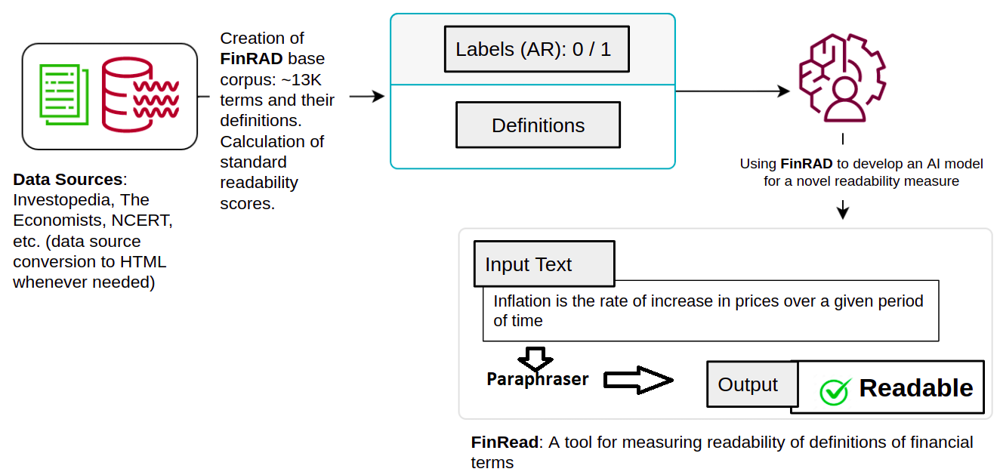
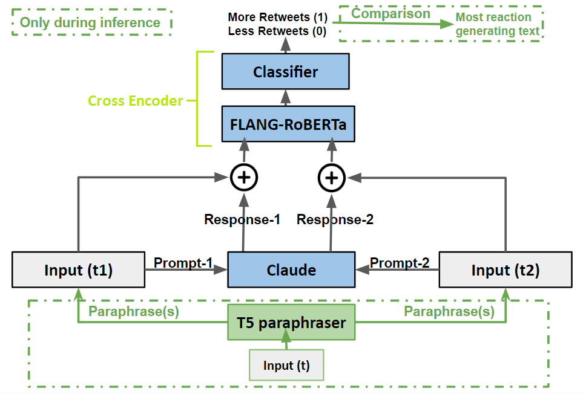
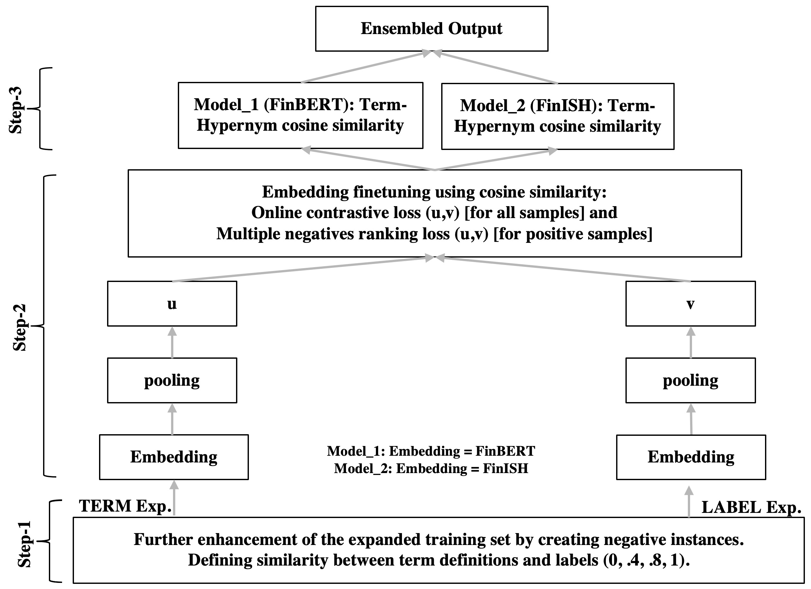
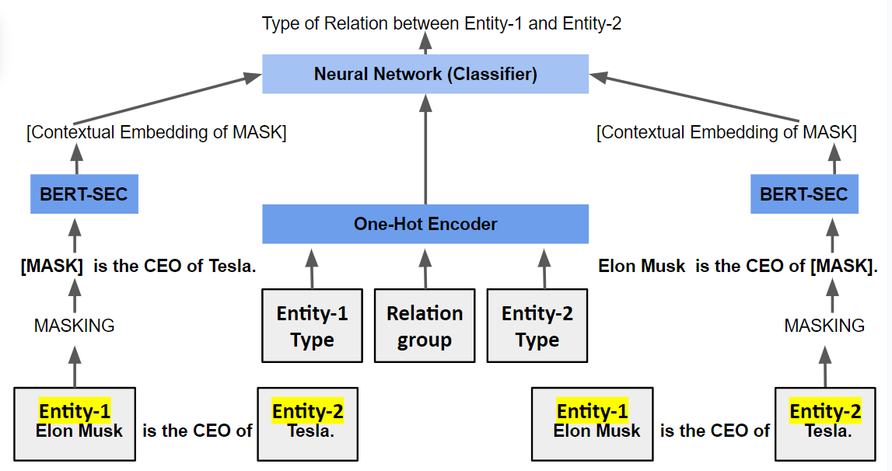
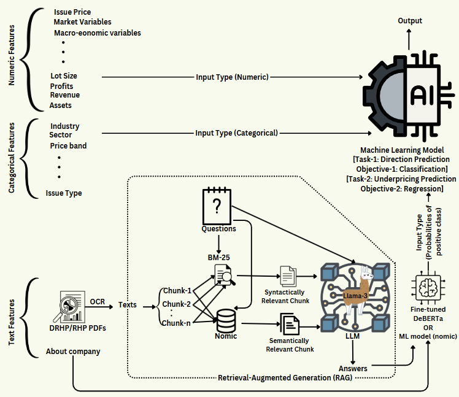
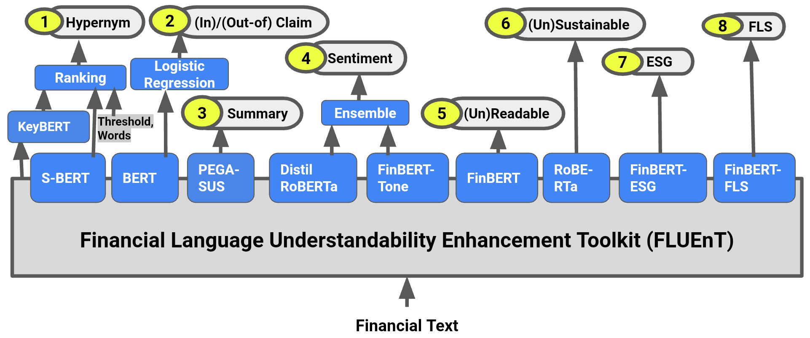
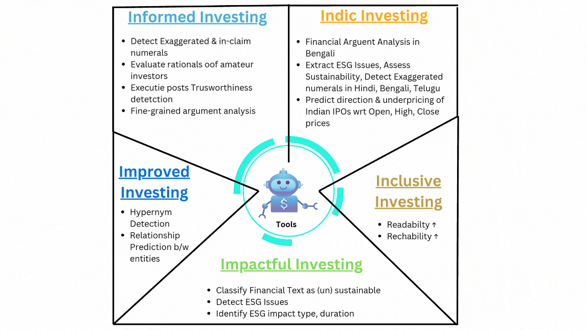

# Skills
- **Languages & Libraries:** Core (Python, PyTorch, SQL & Cloud (AWS)), Machine Learning (Scikit-learn, Pandas, Numpy, XGBoost, LightGBM), Natural Language Processing (NLTK, SpaCy, Transformers, LangChain), User Interface (Gradio, Streamlit), Spark
- **Algorithms & Concepts:** Regression (Linear/Logistic), Decision Trees, Random Forest, Gradient Boosting Machine, Clustering, PCA, Neural Networks, Deep Learning, Large Language Models, Prompt Engineering, RAG, Fine-tuning
- **Others:** LaTeX, MS Office (Word, Excel, PowerPoint), Confluence, Git, Jira, Kanban, Mural
- **Expertise:** Natural Language Processing / Understanding / Generation
- **Domains:** FinTech (Financial Services + Technology), Consumer Internet based Products & Customer Analytics
- **Relevant Coursework:** Technical - Natural Language Processing Specialization (Score >90%), Neural Networks and Deep Learning, Improving Deep Neural Networks: Hyperparameter Tuning, Regularization and Optimization (Score>90%), Prompt Engineering, Large Language Models, Cloud - AWS, Machine Learning Engineering, etc.; Soft skills - Learnship Business English Level 10, Creating Effective Presentations, Creative Thinking; Research - Introduction to Research, NPTEL, Score: 87%, Rank: Top 1%, Domain - Mutual Funds, Stocks etc.
- **Areas of Interest:** Applied NLP, GenAI, ML
- **Soft Skills:** Critical thinking, Communication, Problem Solving, Self-learning, Resilience, Emotional intelligence

# Open Source Academic Research Projects

## Inclusive Investing
Making the investment process more inclusive so that even the economically lower strata of the society can avail financial services.

#### Topics: 
- Improving readability of financial texts
    - Skills: Data Curation, Machine Learning, Natural Language Processing, Readability, Transformers
      
- Improving reach & engagment of financial social media posts
    - Skills: Transformers, Large Language Models (ChatGPT, Claude), Social Media Analytics
      

#### Relevant Publications
- "FinRAD: Financial Readability Assessment Dataset - 13,000+ Definitions of Financial Terms for Measuring Readability" in FNP@LREC-2022 <a href="https://aclanthology.org/2022.fnp-1.1/" target="_blank">(link)</a>
- "Generator-Guided Crowd Reaction Assessment" in TheWebConf (WWW) 2024 <a href="https://arxiv.org/abs/2403.09702" target="_blank">(link)</a>

## Improved Investing
Improving the journey of investments

#### Topics:
- Extracting hypernyms of financial terms
    - Skills: Sentence Transformers, Ontology Mining, Natural Language Processing
      
- Extracting relationship between financial entities
    - Skills: Relation Extraction between Entities, Financial Text Mining, Language Models
      

#### Relevant Publications: 
- "Term Expansion and FinBERT fine-tuning for Hypernym and Synonym Ranking of Financial Terms" in FinNLP@IJCAI 2021 <a href="https://aclanthology.org/2021.finnlp-1.8.pdf" target="_blank">(link)</a>
- "Learning to Rank Hypernyms of Financial Terms using Semantic Textual Similarity" in SN Computer Science (Springer) 2023 <a href="https://arxiv.org/abs/2303.13475" target="_blank">(link)</a>
- "The Mask One At a Time Framework for Detecting the Relationship between Financial Entities" in FIRE 2023 <a href="https://easychair.org/publications/preprint/FKKW/open" target="_blank">(link)</a>

## Impactful (Green) Investing
Considering environmental aspects while investing

#### Topics:
- Classifying a financail text as Sustainable or Unsustainable
- Detecting Environmental, Social and Governance (ESG) Issues from financial texts
- Identifying ESG impact type
- Identifying ESG impact duration

#### Relevant Publications: 
- "Ranking Environment, Social And Governance Related Concepts And Assessing Sustainability Aspects Of Financial Texts" in IJCAI-ECAI 2022 <a href="https://aclanthology.org/2022.finnlp-1.33/" target="_blank">(link)</a>
- "A low resource framework for Multi-lingual ESG Impact Type Identification" in FinNLP@IJCNLP-AACL 2023 <a href="https://aclanthology.org/2023.finnlp-2.8/" target="_blank">(link)</a>

## Informed Investing
Keeping the investors informed and helping them to make data driven decisions

#### Topics:
- Detecting exaggerated and in-claim numerals from Financial Texts
    - Skills: Pre-trained Language Models (BERT), Machine Learning
- Evaluating the effect of Social Media Posts by Executives on Stock Prices
    - Skills: Social Media Analysis, Deep Learning (LSTM, GRU)
- Evaluating the Rationals of Amateur Investors
    - Skills: Transformers, Ensemble Learning
- Fine-grained Argument Understanding in Financial Texts
    - Skills: Cross Encoders, Pre-trained Language Models

#### Relevant Publications: 
- "LIPI at the NTCIR-16 FinNum-3 Task: Ensembling transformer based models to detect in-claim numerals in Financial Conversation" in NTCIR-16 2022 <a href="https://research.nii.ac.jp/ntcir/workshop/OnlineProceedings16/pdf/ntcir/02-NTCIR16-FINNUM-GhoshS.pdf" target="_blank">(link)</a>
- "Evaluating Impact of Social Media Posts by Executives on Stock Prices" in FIRE 2022 <a href="https://arxiv.org/abs/2211.01287" target="_blank">(link)</a>
- "LIPI at the FinNLP-2022 ERAI Task: Ensembling Sentence Transformers for Assessing Maximum Possible Profit and Loss from Online Financial Posts" in FinNLP@EMNLP 2022 <a href="https://aclanthology.org/2022.finnlp-1.13/" target="_blank">(link)</a>
- "LIPI at the NTCIR-17 FinArg-1 Task: Using Pre-trained Language Models for Comprehending Financial Arguments" in NTCIR-17 2023 <a href="https://research.nii.ac.jp/ntcir/workshop/OnlineProceedings17/pdf/ntcir/04-NTCIR17-FINARG-ChakrabortyS.pdf" target="_blank">(link)</a>

## Indic Investing
Helping Indians to manage their wealth

#### Topics:
- Financial Argument Analysis in Bengali
    - Skills: Machine Translation, Multi-lingual NLP, Cross Encoders
- Financial Natural Language Processing for Indian Languages
    - Skills: Multi-lingual Natural Language Processing, Transfromers
- Data driven approaches for predicting success of Indian IPOs 
    - Skills: Multi-modal Natural Language Processing, Large Language Models (LLMs), Retrieval Augmented Generation (RAG), Fine-tuning LLMs
      
-   Predicting Ratings of Indian IPOs from Red Herring Prospectus
    - Skills: Large Language Models, Small Language Models, Retrieval Augmented Generation (RAG)
    
#### Relevant Publications: 
- "Financial Argument Analysis in Bengali" in FIRE 2023 <a href="https://easychair.org/publications/preprint/ZZpZ/open" target="_blank">(link)</a>
- "IndicFinNLP: Financial Natural Language Processing for Indian Languages" in LREC-COLING 2024 <a href="https://aclanthology.org/2024.lrec-main.789/" target="_blank">(link)</a>
- "Experimenting with Multi-modal Information to Predict Success of Indian IPOs" <a href="https://www.arxiv.org/abs/2412.16174" target="_blank">(link)</a>
- "Predicting Ratings of Indian IPOs from Red Herring Prospectus" <a href="https://easychair.org/publications/preprint/G1P2/open" target="_blank">(link)</a>

## FinNLP tools
Open sourcing tools for analysing financial texts

#### Relevant Publications: 
- "FinRead: A Transfer Learning Based Tool to Assess Readability of Definitions of Financial Terms" in ICON-2021 <a href="https://aclanthology.org/2021.icon-main.81/" target="_blank">(link)</a>
- "Fincat: Financial numeral claim analysis tool" in FinWeb@WWW 2022 <a href="https://arxiv.org/abs/2202.00631" target="_blank">(link)</a>
- "Fincat-2:  An enhanced Financial Numeral Claim Analysis Tool" in Software Impacts (Elsevier) 2022 <a href="https://www.sciencedirect.com/science/article/pii/S2665963822000367" target="_blank">(link)</a>
- "FLUEnT: Financial Language Understandability Enhancement Toolkit" in CODS-COMAD 2023 <a href="https://easychair.org/publications/preprint/cWW5/open" target="_blank">(link)</a>
   
  

## Doctoral Thesis

### Title
#### Using Computational Linguistics to Demystify Financial Texts 

### Summary
<a href="https://easychair.org/publications/preprint/GqWf/open/" target="_blank">(link)</a>
### Poster
<a href="https://sohomghosh.github.io/assets/pdf/Sohom_PhD_1page_poster.pdf" target="_blank">(link)</a>
### Video
<a href="https://www.youtube.com/watch?v=L7bd1lgvQKY" target="_blank">(link)</a>
